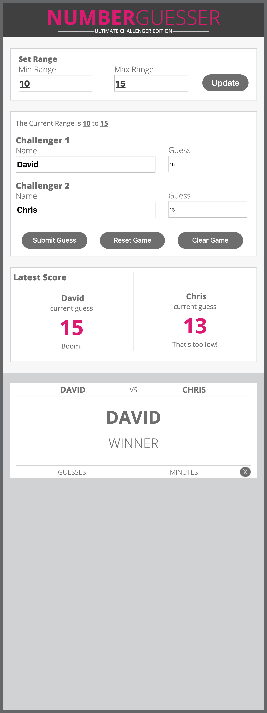
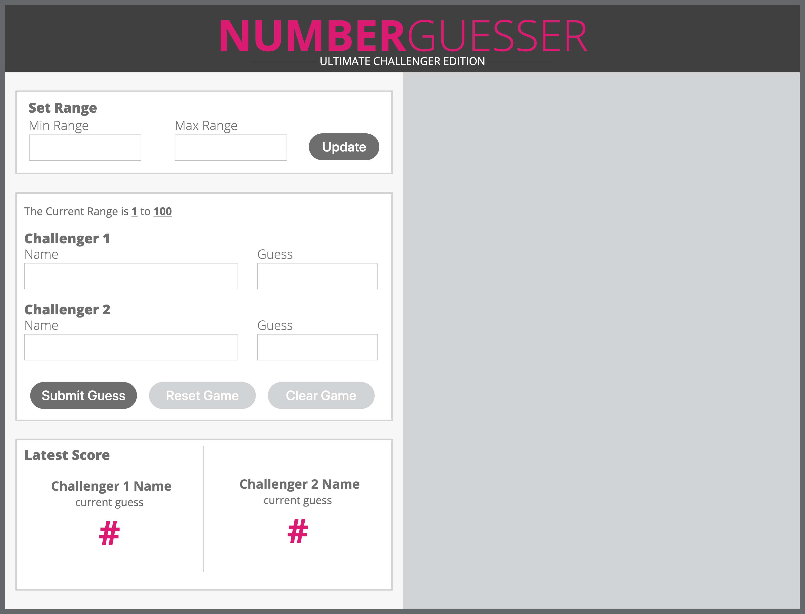

# Number Guesser

Number Guesser is a two-player guessing game, where players select a range of numbers and generate a random number within that range. Each player then enters their name and can try to guess the number as many times as they need until one player gets it! 

## Specs 

The basic layout of the site has the main gameboard on the lefthand side of the page, and an initially empty right column which is space to display cards with the name of the person who first guesses the random number. 

Controls to choose the range of numbers are found at the top of the page. The central portion contains fields for the players names and individual guesses, along with buttons at the bottom of that section to submit the guesses, "reset" the game and generate a new random number within the specified range, and clear out all of the previously filled fields. 

When a player guesses the randomly generated number correctly, a card is generated in the righthand column containing that player's name, as well as the names of the players from that match. 

## Display

Each element of the site was designed to be fairly responsive to begin with, but there are also two media queries to increase that responsiveness. At a screen width of 1050px the display changes to a single column, and the text elements and buttons resize slightly. At 750px each element resizes yet again, and goes down to the minimum width of the browser without further distortion. 

## The Comp

## Our Site

